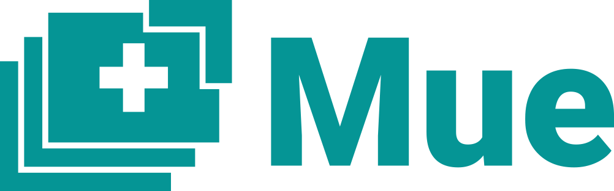

# Mue

Fast, open and free-to-use new tab page for most modern browsers.

*This is the code for the extension. If you are looking for the website code, please go [here](https://github.com/TurboMarshmello/muetab.xyz).*

## Features
* Fast and free
* Supports multiple browsers
* Actively developed and opensource
* Automatically updating API (with no tracking!) with new photos and offline mode
* ~~Multiple language support~~
* ~~Settings feature - enable/disable features!~~
* Search bar, ~~update modal, copy button and more!~~

* Mue has been recently rewritten with React and is missing the features that are crossed out *

## Installation
### Chrome
 

Link: [Chrome Web Store](https://chrome.google.com/webstore/detail/mue/bngmbednanpcfochchhgbkookpiaiaid)

Development: Read the [Development](#development) section.
### Firefox
 

Link: [Firefox Add-ons](https://addons.mozilla.org/firefox/addon/mue)

Development: Read the [Development](#development) section.
### Opera/Other
Link: [GitHub Releases](https://github.com/ohlookitsderpy/Mue/releases)

Development/Other: Read the [Development](#development) section.
### Development
<h5>Requirements</h5>
<ol>
  <li><a href='https://git-scm.com'>Git</a> (optional)</li>
  <li><a href='https://nodejs.org'>Node.js</a></li>
  <li>A suitable browser</li>
</ol>
<h5>Starting</h5>
<ol>
  <li> <code>git clone https://github.com/ohlookitsderpy/Mue</code> (If you don't have Git just go to <b>Clone or
      download</b> and click <b>Download ZIP</b>)
  <li> Open a terminal and run these commands: (in the Mue directory)
  <li> <code>yarn</code> (or <code>npm install</code>)
  <li> <code>yarn start</code> (or <code>npm start</code>)
  <li> Start developing! (See the sections below for how to set up a developer copy of the extension.)
</ol>

  
<b>Chrome</b> (Click to expand)

  <ol>
    <li> Rename <code>manifest-chrome.json</code> to <code>manifest.json</code>
    <li> Visit <code>chrome://extensions</code> in Chrome
    <li> Click <b>Load unpacked</b> (Make sure <b>Developer Mode</b> is on)
    <li> Go to the directory containing Mue and click <b>ok</b>
    <li> Enjoy your new tab!

  
<b>Opera</b> (Click to expand)

  <ol>
    <li> Rename <code>manifest-opera.json</code> to <code>manifest.json</code>
    <li> Visit <code>about://extensions</code> in Opera
    <li> Click <b>Load unpacked extension...</b> (Make sure <b>Developer Mode</b> is on)
    <li> Go to the directory containing Mue and click <b>ok</b>
    <li> Enjoy your new tab!

  
<b>Firefox</b> (Click to expand)

  <i>Note: I'm currently trying to find a better method to do this, but this works for now.</i>
  <ol>
    <li> Rename <code>manifest-firefox.json</code> to <code>manifest.json</code>
    <li> Visit <code>about:debugging#addons</code> in Firefox
    <li> Click <b>Load Temporary Add-on</b>
    <li> Go to the directory containing Mue and click on the <b>manifest.json</b>
    <li> Enjoy your new tab!
  </ol>

  
<b>Other</b> (Click to expand)

  <i>Note: To get the full new tab experience, set your browser to open the <code>index.html</code> on startup and tab open!</i>
    <ol>
      <li> Open the <code>index.html</code> in your browser
      <li> Enjoy your new tab!
    </ol>

## Screenshot
*Will be updated if needed*

## Credits
### Maintainers
[ohlookitsderpy](https://github.com/ohlookitsderpy)

[TurboMarshmello](https://github.com/TurboMarshmello)

### Other
[TurboMarshmello](https://github.com/TurboMarshmello) - Portions of original code, name idea

[Pexels](https://pexels.com) - Stock photos used for offline mode

[Opera Forum](https://forums.opera.com/topic/25046/how-to-disable-completely-the-speed-dial/14) - Portions of code to add Opera support

### Translations
[ohlookitsderpy](https://github.com/ohlookitsderpy) - English (Quotes and Messages)

[Yanderella](https://github.com/tomiedev) - Italian (Quotes and Messages)

Pepehound - Spanish (Quotes and Messages)

Candystick - Portuguese (Some Quotes)

[PassTheWessel](https://github.com/PassTheWessel) - Dutch (Messages)

[Yanderella](https://github.com/tomiedev) and [ohlookitsderpy](https://github.com/ohlookitsderpy) - French (Messages)

[untocodes](https://github.com/untocodes) - Finnish and German (Messages)

[dondish](https://github.com/dondish) - Hebrew and Russian (Messages)

[MrSheldon](https://github.com/MrSheldon) - Arabic and Swedish (Messages)

*Feel free to pull request with other translations!*

and all the contributors <3
