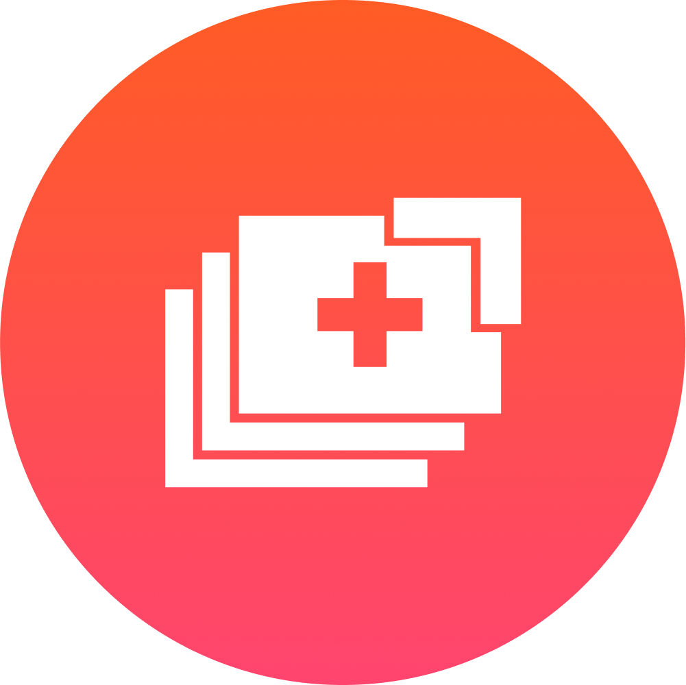
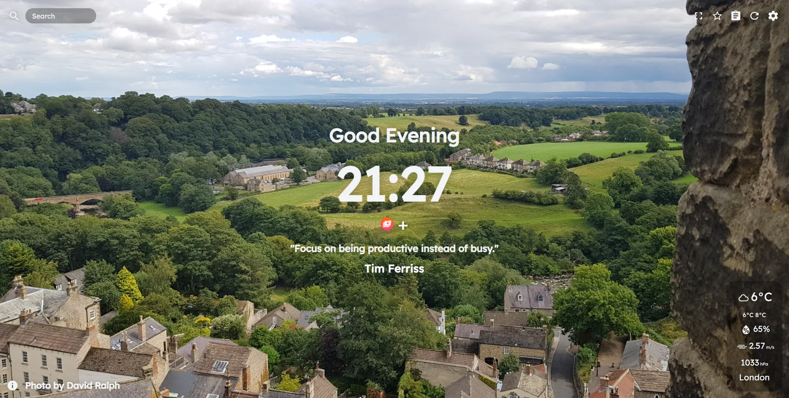
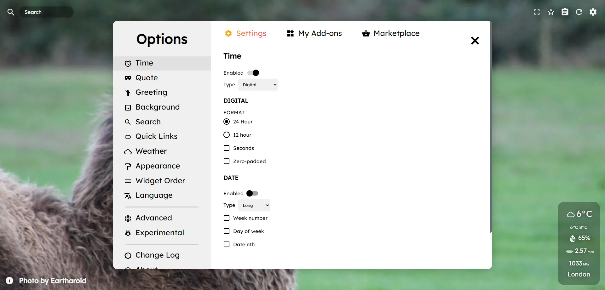

> <a href="https://muetab.com/">Mue</a>

  
 
  

Mue is a fast, open and free-to-use browser extension that gives a new, fresh and customisable tab page to modern browsers.

 

## Table of contents
- [Table of contents](#table-of-contents)
- [Screenshots](#screenshots)
- [Features](#features)
  - [Planned Features](#planned-features)
- [Installation](#installation)
  - [Chrome](#chrome)
  - [Firefox](#firefox)
  - [Edge (Chromium)](#edge-chromium)
  - [Whale](#whale)
  - [Other](#other)
- [Development](#development)
  - [Translations](#translations)
- [Credits](#credits)
  - [Developers](#developers)
  - [Translators](#translators)
  - [Contributors](#contributors)
  - [Resources](#resources)

## Screenshots

## Features

- Fast and free
- Supports multiple browsers
- Actively developed and open source
- Automatically updating [API](https://github.com/mue/api) with new photos, quotes and offline mode
- Widgets such as search bar, weather, quick links, clock, date, quote, greeting
- Settings - enable/disable various features and customise parts of Mue
- Navbar with copy button, favourite background, notes feature etc
- [Marketplace](https://github.com/mue/marketplace) - download custom photo packs, quote packs and preset settings made by the community

### Planned Features

Please see our [roadmap](https://trello.com/b/w7zhS7Hi/mue-50).

## Installation

_A demo of the tab can be found [here](https://demo.muetab.com), and the latest GitHub commit build [here](https://mue.vercel.app)_

### Chrome

 
[Chrome Web Store](https://chrome.google.com/webstore/detail/mue/bngmbednanpcfochchhgbkookpiaiaid)

### Firefox

 
[Firefox Add-ons](https://addons.mozilla.org/firefox/addon/mue)

### Edge (Chromium)

[Microsoft Edge Addons](https://microsoftedge.microsoft.com/addons/detail/aepnglgjfokepefimhbnibfjekidhmja)

### Whale

[Whale Store](https://store.whale.naver.com/detail/ecllekeilcmicbfkkiknfdddbogibbnc)

### Other

[GitHub Releases](https://github.com/mue/mue/releases)

## Development

Please see the [documentation](https://docs.muetab.com/development#mue-tab).

### Translations

## Credits

### Developers

[David Ralph](https://github.com/davidcralph) - Lead development, photographer  
[Alex Sparkes](https://github.com/alexsparkes) - Name, lead design, photographer  
[Isaac Saunders](https://github.com/eartharoid) - QA, development, photographer  
[Wessel Tip](https://github.com/Wessel) - Development  

### Translators

[Wessel Tip](https://github.com/Wessel), [Heimen Stoffels](https://github.com/Vistaus) - Dutch  
[Alex Sparkes](https://github.com/alexsparkes), [Maxime](https://github.com/exiam) - French  
[Anders](https://github.com/FuryingFox) - Norwegian  
[Pronin Egor](https://github.com/MrZillaGold) - Russian  
[Vicente](https://github.com/Vicente015) - Spanish  
[Austin Huang](https://github.com/austinhuang0131) - Chinese (Simplified)  
[FreeFun](https://github.com/xXFreeFunXx) - German  
[Aksal](https://github.com/aksalsf) - Indonesian  
[Kağan Can Şit](https://github.com/KaganCanSit) - Turkish  
efeaydal - Turkish  
### Contributors

Many thanks to the photographers [here](https://api.muetab.com/images/photographers) for letting us use their wonderful photographs.

And finally, a big thank you to all the other [contributors](https://github.com/mue/mue/graphs/contributors)!

### Resources

[Pexels](https://pexels.com), [Unsplash](https://unsplash.com) - Stock photos used for offline mode  
[Undraw](https://undraw.co) - Welcome modal images

This project is supported by:

  

