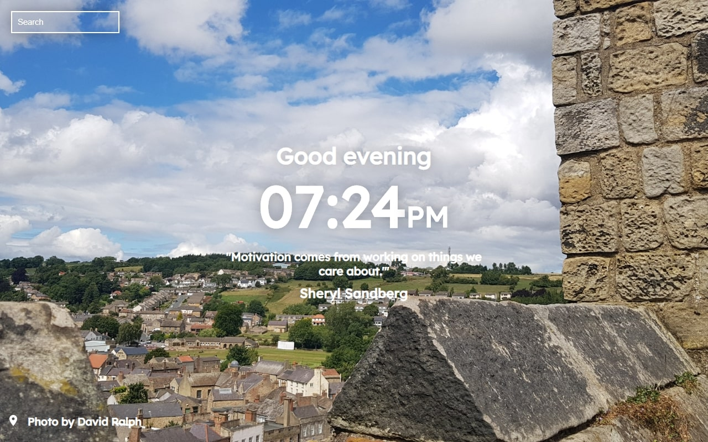

> <a href="https://muetab.xyz/">Mue</a>

  
 
  

Mue is a fast, open and free-to-use browser extension that gives a new, fresh and customizable tab page to most modern browsers

 

## Table of contents
* [Screenshot](#screenshot)
* [Features](#features)
* [Planned Features](#planned-features)
* [Installation](#installation)
	* [Chrome](#chrome)
	* [Firefox](#firefox)
	* [Chromium](#edge-chromium)
	* [Opera/Other](#operaother)
* [Contributing](#development)
	* [Requirements](#requirements)
	* [Starting](#starting) 
	* [Building](#building)
* [Credits](#credits)
	* [Maintainers](#maintainers)
	* [Contributors]()
	* [Other](#other)

## Screenshot
*May be updated in the future*

## Features
* Fast and free
* Supports multiple browsers
* Actively developed and open source
* Automatically updating API (with no tracking!) with new photos, quotes and offline mode
* Search bar

## Planned Features
* Settings - enable/disable features!
* Update modal, copy button and more!
* Multilingual support

## Installation
*A demo of the tab can be found [here](https://mue.now.sh)*
### Chrome

 
[Chrome Web Store](https://chrome.google.com/webstore/detail/mue/bngmbednanpcfochchhgbkookpiaiaid)

### Firefox

 
[Firefox Add-ons](https://addons.mozilla.org/firefox/addon/mue)

### Edge (Chromium)
[Microsoft Edge Addons](https://microsoftedge.microsoft.com/addons/detail/aepnglgjfokepefimhbnibfjekidhmja)

### Opera/Other
Link: [GitHub Releases](https://github.com/mue/mue/releases)

### Development
#### Requirements
<ol>
  <li><a href='https://git-scm.com'>Git</a> (optional)</li>
  <li><a href='https://nodejs.org'>Node.JS</a></li>
  <li>A suitable browser</li>
</ol>
<h5>Starting</h5>
<ol>
  <li> clone the repository using <code>git clone https://github.com/mue/mue.git</code>
  <li> run <code>yarn</code> or <code>npm i</code> to install all needed dependencies
  <li> run <code>yarn start</code> or <code>npm start</code> to start testing
  <li> Code your heart out! (See the sections below for how to build the extension)
</ol>
<h2>Building</h5>

  
<b>Chrome/Edge (Chromium)</b> (Click to expand)

  <ol>
    <li> <code>yarn run build</code> or <code>npm run build</code>
    <li> Rename <code>manifest-chrome.json</code> in the "manfiest" folder to <code>manifest.json</code> in "build"
    <li> Visit <code>chrome://extensions</code> in Chrome
    <li> Click <b>Load unpacked</b> (Make sure <b>Developer Mode</b> is on)
    <li> Go to the directory containing the built copy of Mue and click <b>ok</b>
    <li> Enjoy your new tab!

  
<b>Opera</b> (Click to expand)

  <ol>
    <li> <code>yarn run build</code> or <code>npm run build</code>
    <li> Rename <code>manifest-opera.json</code> in the "manfiest" folder to <code>manifest.json</code> in "build"
    <li> Copy <codebackground-opera.js</code> in the "manifest" folder to "build"
    <li> Visit <code>about://extensions</code> in Opera
    <li> Click <b>Load unpacked extension...</b> (Make sure <b>Developer Mode</b> is on)
    <li> Go to the directory containing Mue and click <b>ok</b>
    <li> Enjoy your new tab!

  
<b>Firefox</b> (Click to expand)

  <ol>
    <li> <code>yarn run build</code> or <code>npm run build</code>
    <li> Rename <code>manifest-firefox.json</code> in the "manfiest" folder to <code>manifest.json</code> in "build"
    <li> Move <code>manifest/background-opera.js</code> to <code>build/background-opera.js</code>   
    <li> Visit <code>about:debugging#addons</code> in Firefox
    <li> Click <b>Load Temporary Add-on</b>
    <li> Go to the directory containing Mue and click on the <b>manifest.json</b>
    <li> Enjoy your new tab!
  </ol>

  
<b>Other</b> (Click to expand)

  <i>Note: To get the full new tab experience, set your browser to open the <code>index.html</code> on startup and tab open!</i>
    <ol>
      <li> <code>yarn run build</code> or <code>npm run build</code>
      <li> Open the <code>index.html</code> in your browser
      <li> Enjoy your new tab!
    </ol>

## Credits
### Maintainers
[ohlookitsderpy](https://github.com/ohlookitsderpy) - Founder, Lead development, Photographer  
[TurboMarshmello](https://github.com/TurboMarshmello) - Name, Lead design,  

### Other
[Pexels](https://pexels.com) - Stock photos used for offline mode

[Opera Forum](https://forums.opera.com/topic/25046/how-to-disable-completely-the-speed-dial/14) - Portions of code to add Opera support  
[Google Fonts](https://fonts.google.com/specimen/Lexend+Deca) - Lexend Deca font

### Contributors
[Wessel](https://github.com/Wessel) - Development  
[Isaac](https://github.com/eartharoid) - Development  
[Chris](https://github.com/auguwu) - Development  

And many thanks to [Highholding](https://discord.bio/p/highholding), [Noa Shapira](#), [Roee Lupo](https://github.com/MrSheldon), [Jeroen](#), [Glasvegas](https://twitter.com/_glasvegas), [Anders](https://github.com/FuryingFox/), [Oded Shapira](https://twitter.com/dondishdev) and [Nikka Lai](#) for letting us use their wonderful photographs
