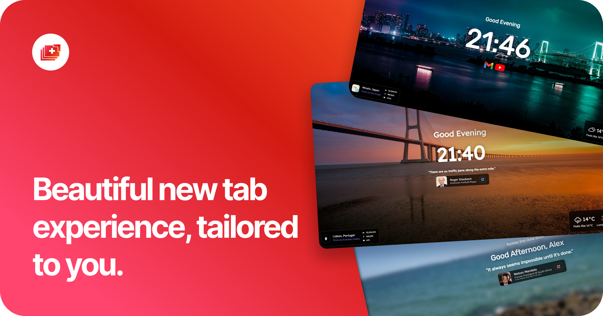
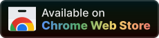
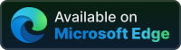

<h1 align="center">Mue</h1>

A fast, open and free-to-use browser extension that gives a new, fresh and customisable tab page to modern browsers.

<a href="https://muetab.com">muetab.com</a>

## 🤔 Why Mue?
- Beautiful and Minimalist Design
- Customisable Layout
- Widgets (such as weather, notes, bookmarks and more)
- Privacy-Focused - does not track your browsing activity
- Extensible with the Mue Marketplace
- Open Source under the BSD-3 License

## 🌶️ Installation
Mue can be downloaded on the following browsers:

- [Chrome](https://chromewebstore.google.com/detail/mue/bngmbednanpcfochchhgbkookpiaiaid)
- [Edge](https://microsoftedge.microsoft.com/addons/detail/mue/aepnglgjfokepefimhbnibfjekidhmja)
- [Firefox](https://addons.mozilla.org/en-GB/firefox/addon/mue/)
- [Whale](https://store.whale.naver.com/detail/ecllekeilcmicbfkkiknfdddbogibbnc)

and can be manually sideloaded on others using the files on [GitHub Releases](https://github.com/mue/mue/releases)

## 🚀 Demo
A fully-featured demo of the tab extension is available in-browser at [demo.muetab.com](https://demo.muetab.com)

## 💻 Development
Install dependencies with ``bun install``, and then you can run any of the following scripts as needed:

- `bun run dev[:host]` - start development server
- `bun run build` - build production copy of Mue
- `bun run lint[:fix]` - run linter
- `bun run pretty` - run prettier
- `bun run translations` - migrate old translation format to new

## 🐳 Docker development
Hot reload is available while coding.

- `docker build -t mue-app .` - build the image

- `docker volume create dev-bun-app` - create a volume for the app

- `docker run -p 5173:5173 mue-app` - run the container

- `docker run -p 5173:5173 \
  -v $(pwd):/app \
  -v dev-bun-app:/app/node_modules \
  mue-app 
` - run the container

Navigate to http://localhost:5173

## 🌍 Translations
We use [Weblate](https://weblate.org) for translations. To get started, please visit the [project](https://hosted.weblate.org/projects/mue/) and look for the latest version to start translating Mue into your langauge.

## Attribution
[Pexels](https://pexels.com), [Unsplash](https://unsplash.com) - Stock photos used for offline mode  
[Undraw](https://undraw.co) - Welcome modal images
